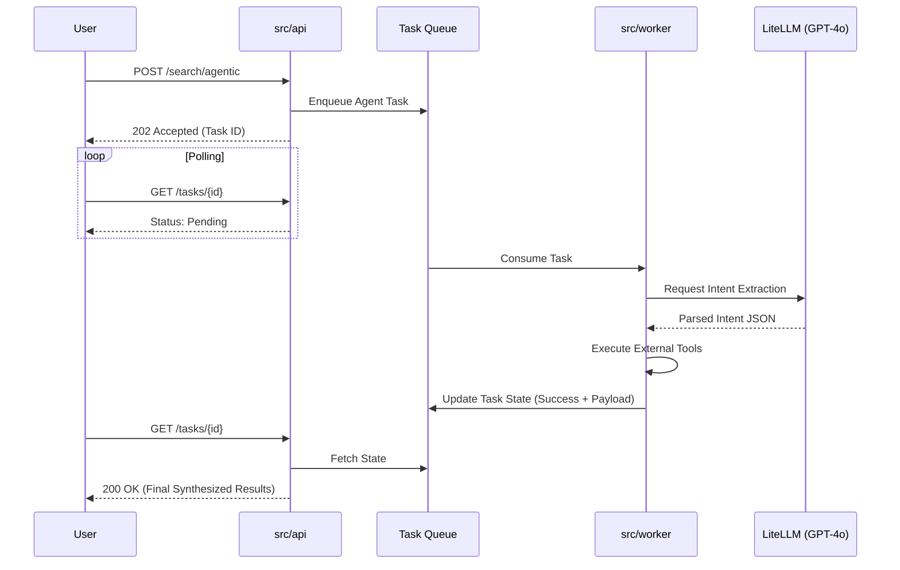

# A Crash Course in Agentic Search Architecture

**Target Audience:** Mid-to-senior Python developers proficient in standard Web APIs (FastAPI), seeking to bridge into modern Information Retrieval (IR), Vector Semantics, and Asynchronous ML Operations at scaling boundaries.

## Introduction: The Paradigm Shift

Historically, standard CRUD web applications focused solely on direct SQL relational lookups. The paradigm has shifted towards **Agentic Intelligence Systems**—environments where the system autonomously interprets vague human intent, mathematically measures semantic similarity, and defers complex multi-stage synthesis pipelines to asynchronous worker queues. 

We split this repository strictly into separated microservices (`gateway_api`, `inference_service`, `worker`). Why? 
Because CPU-bound machine learning matrix multiplications (like calculating 384-dimensional embeddings in PyTorch) will instantly stall an asynchronous I/O web thread like FastAPI parsing event loops. **Compute Isolation** solves this inherently, guaranteeing low-latency scalability natively.

### The Kubernetes (V10) Orchestration Shift
Running complex microservices efficiently requires dynamic orchestration. We transitioned our local and production deployment posture from **Docker Compose** directly to **Kubernetes** utilizing `kind` locally. This ensures:
- **Self-Healing Infrastructure**: Kubernetes automatically restarts pods that fail liveness probes.
- **Advanced Rollouts**: We can confidently stream updates into production leveraging zero-downtime rolling updates.
- **Resource Scheduling**: Kubernetes places CPU-heavy PyTorch containers accurately onto specific compute nodes containing adequate memory dynamically.

---

## Module 1: The Modern Data Pipeline (Handling 7M Rows Locally)

### Polars vs. Pandas
Processing massive enterprise datasets (like a 7-million row CSV) locally will trigger fatal Out-Of-Memory (OOM) errors utilizing standard PyData memory heaps natively mapped inside Pandas. We utilize **Polars**, an explicitly typed, multithreaded DataFrame library written in Rust prioritizing Lazy Evaluation.

```python
# Standard Pandas (Eager Execution)
# Reads the entire 7M row CSV straight into RAM. Usually kills the process.
import pandas as pd
df = pd.read_csv("heavy_data.csv")
filtered_df = df[df['industry'] == 'artificial intelligence']

# Polars (Lazy Execution)
# Zero-copy planning. Execution only happens precisely upon `collect()`.
import polars as pl
query = (
    pl.scan_csv("heavy_data.csv")
    .filter(pl.col("industry") == "artificial intelligence")
    .select(["company_name", "description"])
)
# The Rust engine optimizes the filter push-down natively before reading
lazy_df = query.collect() 
```

### Chunking & Streaming Ingestion
When pushing massive datasets directly towards OpenSearch, loading 7M rows bounds immediately fails. We execute **streaming ingestion**, tearing the evaluated DataFrame apart explicitly mapping lists of 5,000 document dictionaries directly into OpenSearch `helpers.bulk` mapping pipelines. 

```python
from opensearchpy import helpers, OpenSearch

def yield_chunks(dataframe: pl.DataFrame, chunk_size=5000):
    """Generator yielding manageable memory bounds."""
    for i in range(0, len(dataframe), chunk_size):
        chunk = dataframe.slice(i, chunk_size).to_dicts()
        
        # Prepare valid OpenSearch index actions natively
        actions = []
        for row in chunk:
            actions.append({
                "_index": "companies",
                "_id": row["id"],
                "_source": {
                    "name": row["name"],
                    "description": row["description"]
                }
            })
        yield actions

# Stream chunks securely holding only 5000 items in Python memory globally
client = OpenSearch(["http://localhost:9200"])
for action_batch in yield_chunks(lazy_df):
    helpers.bulk(client, action_batch)
```

### Embeddings at the Edge
OpenAI embedding APIs cost thousands of dollars when analyzing millions of string segments. Instead, we compute embeddings "at the edge" inside our isolated Docker instances. We utilize `sentence-transformers` loading `all-MiniLM-L6-v2`. This model translates a text string into a **384-dimensional dense vector**—an array of 384 floating-point numbers mapping exactly where this string sits inside semantic "concept space" mathematically.

```python
from sentence_transformers import SentenceTransformer

# Loaded once into singleton memory preventing disk trashing
model = SentenceTransformer("all-MiniLM-L6-v2")

embedding = model.encode("Next-gen cloud native cybersecurity")
# Output: [-0.043, 0.122, 0.822, ...] (Length: 384)
```

---

## Module 2: Information Retrieval (IR) Crash Course

### The Datastore (OpenSearch)
OpenSearch maintains a powerful dual identity natively handling two entirely distinct query mechanisms simultaneously:
1. **The Inverted Index:** Analogous to the glossary of a book mapping words directly identically towards document IDs (used for BM25 Keyword Search).
2. **The Vector Database:** A highly optimized numeric space utilizing HNSW (Hierarchical Navigable Small World) graphs to cluster dense coordinates mathematically.

### Deterministic vs. Semantic Search
- **Keyword/BM25 Search (Deterministic):** Exact algorithmic token matches. By utilizing `keyword` mapping types vs `text`, OpenSearch guarantees exact aggregations executing extremely quickly against rigid bounded variables (e.g. `size_range="1000-5000"` and `year_founded=2015`).
- **k-NN Vector Search (Semantic):** Measuring **Cosine Similarity** geometrically measuring distances between arrays. This allows the system to comprehend that a query looking for "software" highly mathematically maps toward candidates listing "IT", despite sharing exactly zero overlapping character tokens natively.

### Hybrid Search Implementation
In a production Tier-1 engine, we blend both constraints universally leveraging **Hybrid pipelines**:
```json
{
  "query": {
    "bool": {
      "filter": [
        {"term": {"location.keyword": "California"}},
        {"range": {"employees": {"gte": 50}}}
      ],
      "must": {
        "knn": {
          "description_embedding": {
            "vector": [0.12, -0.45, ... 384 elements],
            "k": 100
          }
        }
      }
    }
  }
}
```
*Notice above:* The `filter` block executes instantly leveraging cached inverted indices natively, shrinking the pool to only California companies over 50 employees *before* running the expensive k-NN similarity vector distances locally.

---

## Module 3: The Intelligence Layer & Agentic Routing

### LLMs as Routers (LiteLLM & Pydantic)
How does a raw query ("Give me mid-sized tech companies in NY") map against rigid filters precisely? We leverage **Query Routers**. We invoke extremely fast models like `gemini-3.1-flash-lite-preview` utilizing strict `Pydantic` `response_format` configurations preventing conversational hallucinations entirely:

```python
import litellm
import json
from pydantic import BaseModel
from typing import Optional

class IntentSchema(BaseModel):
    is_agentic: bool
    is_standard_search: bool
    location_filter: Optional[str]
    industry_filter: Optional[str]

# Fast, cheap $0.0001 inference explicitly returning JSON
response = litellm.completion(
    model="gemini/gemini-3.1-flash-lite-preview",
    messages=[{"role": "user", "content": "mid-sized tech in NY"}],
    response_format=IntentSchema
)

intent_dict = json.loads(response.choices[0].message.content)
# Output: {"is_agentic": False, "is_standard_search": True, "location_filter": "NY", "industry_filter": "tech"}
```

### Asynchronous Agents (Celery & Redis)
If `is_agentic = True` (e.g. the user wants a synthesized competitive analysis), evaluating it natively inside FastAPI would result entirely in an immediate HTTP stall. Instead, the API gateway executes an HTTP 202 returning a `task_id`. A **Celery Worker Queue** offloads this computational footprint asynchronously:

```python
# src/api/routers/async_tasks.py
@router.post("/agentic", status_code=202)
def trigger_agent(query: str):
    # Fire and forget into Redis queue mapping
    task = process_agentic_workflow.delay(query)
    return {"message": "Accepted", "task_id": task.id}

# src/worker/agent_workflows.py
from celery import shared_task

@shared_task(bind=True)
def process_agentic_workflow(self, query: str):
    # 1. Scrape the web for generic queries
    # 2. Extract news via Gemini API explicitly safely
    # 3. Cache the synthesis back securely securely
    return {"status": "SUCCESS", "analysis": "..."}
```



---

## Module 4: Advanced Relevance & Over-Engineering (The "Deep Dive")

### Two-Stage Retrieval (Cross-Encoders)
Relying solely on Vector Bi-encoders (`all-MiniLM-L6-v2`) provides high **Recall** (finding relevant datasets over large corporas) but occasionally low **Precision** (ordering them accurately based on token grammar nuances).
To solve this, we execute **Two-Stage Retrieval**:
1. **Stage 1**: Execute rapid k-NN bounds retrieving the **Top 100** loose candidate companies.
2. **Stage 2**: Send exactly these 100 texts towards our ML Inference Service explicitly scoring pairs utilizing a massive **Cross-Encoder** (`ms-marco-MiniLM-L-6-v2`).
3. Sort boundaries exactly down towards the **Top 10** returning incredibly precise mappings globally.

*Code intuition:*
```python
# Bi-Encoder (Produces two separate vectors)
vec_a = encode("startup")
vec_b = encode("tech-firm")
similarity(vec_a, vec_b) # Fast, but misses linguistic context natively

# Cross-Encoder (Produces a direct relationship score predicting relevance 0-1)
score = cross_encode(["startup", "tech-firm"]) # ~0.92 (Slow, but highly accurate linguistically)
```

### Semantic Caching
Why execute `$0.01` LiteLLM routing calls continuously targeting identically re-phrased queries? The system hashes input queries generating SHA-256 strings bounding **Redis SETEX** constraints (24 Hour Time-To-Live expiration tags). This prevents expensive repetitive generation costs reliably globally safely smoothly avoiding throttling limits globally.

### Future Scaling Evolution
- **ColBERT (Late Interaction):** Instead of collapsing a 200-word document towards a single 384-d vector mathematically losing semantic depth entirely, ColBERT maintains token-level embeddings mapping exact matrix nuances locally scoring overlaps efficiently.
- **GraphRAG:** Mapping precise company-to-company relationships mapping multi-hop bounds explicitly utilizing Neo4j graph nodes precisely dynamically (e.g., *Find investors who funded Acme Corp AND previously worked at FooBar Inc*).

---

## Module 5: Clean Code & V3 Modern Tooling

### The Move to `uv`
Standard `pip` and `venv` setups struggle dynamically under complex ML requirement graphs. We transitioned globally towards `uv`, a Rust-based, blazingly fast package resolver. It manages virtual environments implicitly (`uv sync`) and executes isolated binaries instantly (`uv run ruff check .`).

### SOLID Principles: Strategy & Dependency Injection
To ensure testability and decouple the FastAPI router from rigid OpenSearch clients, V3 injects dependencies natively:
```python
@router.post("/search")
async def intelligent_search(
    request: SearchRequest,
    os_client: OSClient = Depends(get_os_client),
    llm_client: LLMClient = Depends(get_llm_client),
) -> IntelligentSearchResponse:
```
Furthermore, the execution paths delegate exactly directly into defined strategies (`SemanticSearchStrategy`, `AgenticSearchStrategy`), enforcing the Open-Closed Principle elegantly seamlessly mapping testing implementations cleanly.

---

## Module 5: Observability & Production Readiness

### Beyond `print()`
Scaling out of a monolith destroys standard `print()` logging boundaries completely. Tracking a bug where 4 separate standalone Docker containers interact concurrently is impossible leveraging standard outputs.

### OpenTelemetry (OTLP) & Jaeger
We utilize standard CNCF `opentelemetry` natively injecting correlation traces across HTTP and gRPC headers natively securely safely dynamically.
- **Trace ID**: A globally unique identifier mapping exactly towards one single user interaction.
- **Span**: A specific chunk of tracked work (e.g., "HTTP POST /embed" or "OpenSearch KNN Execute").

```python
# gateway_api/app/core/telemetry.py
from opentelemetry.instrumentation.fastapi import FastAPIInstrumentor
from opentelemetry.instrumentation.requests import RequestsInstrumentor

# Automatically injects X-Trace-ID headers securely bridging boundary layers
FastAPIInstrumentor.instrument_app(app)
RequestsInstrumentor().instrument()
```

When you open `http://localhost:16686` (Jaeger UI), you visually dissect precisely execution lengths natively tracing headers safely passed exactly from the FastAPI Gateway across directly into the PyTorch Inference service measuring millisecond bottlenecks dynamically.
