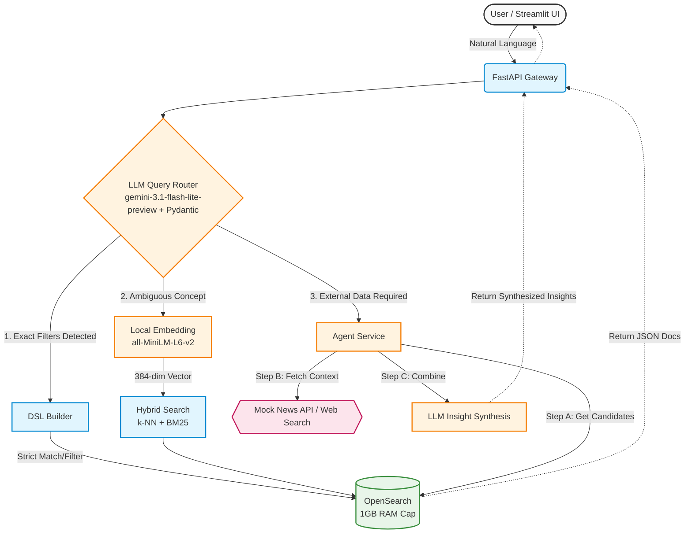

# scaling-succotash

# B2B Company Search & Intelligence API

**Author:** Surya  
**Role:** Search and Intelligence Lead Assessment

## Overview
This repository contains a production-ready, scalable search API and Streamlit UI designed to index and query a 7-million-row B2B company dataset. 

It moves beyond traditional keyword filtering by implementing an **Intelligent Query Router**. The system dynamically classifies natural language queries and routes them to the most efficient retrieval path: standard OpenSearch DSL (for speed), Hybrid Semantic Vector Search (for conceptual matching), or an Agentic Tool-Calling workflow (for external context).

## System Architecture

To balance high-throughput standard search (60 RPS) with computationally expensive AI workflows (30 RPS), the architecture relies on strict separation of concerns and intent routing.



### The Three Retrieval Paradigms:
1. **Deterministic Path:** If a user asks for "IT companies in California", the LLM extracts `{"industry": "information technology", "state": "california"}`. This bypasses vector search entirely, converting directly to OpenSearch DSL for millisecond latency.
2. **Semantic Path:** If a user asks for "software companies" (a term not explicitly in the dataset's industry list), the query is locally embedded using `all-MiniLM-L6-v2` and matched against document vectors using k-NN, bridging the vocabulary gap.
3. **Agentic Path:** Queries requiring temporal or external knowledge (e.g., "companies that announced funding recently") trigger an agent. The agent retrieves candidate companies from OpenSearch, executes a simulated web search tool to gather external context, and synthesizes a final response.

---

## Local Setup & Execution

### Prerequisites
* Docker & Docker Compose
* Python 3.11+

### 1. Start Infrastructure
To prevent laptop OOM errors, the OpenSearch container is explicitly capped at 1GB of JVM memory.
```bash
docker-compose up -d
```

### 2. Environment Setup
```bash
python -m venv venv
source venv/bin/activate
pip install -r requirements.txt
cp .env.example .env
# Add your GEMINI_API_KEY to the .env file for the LiteLLM router
```

### 3. Data Pipeline & Ingestion
Download the [Free 7 Million Company Dataset](https://www.kaggle.com/datasets/peopledatalabssf/free-7-million-company-dataset) from Kaggle and place the CSV in the `data/` directory.

Because loading 7M rows into Pandas will crash most local machines, the ingestion script uses **Polars** for lazy, chunked processing and **SentenceTransformers** for local embedding generation.

*Note: Generating 7 million embeddings locally takes significant time. For review purposes, use the `--limit` flag to ingest a representative subset.*

```bash
# Ingest the first 100,000 rows for testing
python scripts/ingest_data.py --file data/companies.csv --limit 100000
```

### 4. Run the API and UI
Start the FastAPI backend:
```bash
uvicorn app.main:app --reload --port 8000
```
In a new terminal, start the Streamlit UI:
```bash
streamlit run frontend/app.py
```

---

## Scaling Documentation (10x Load Strategy)

The current architecture handles 60 RPS locally, but to scale to 600+ RPS and 300+ Agentic RPS in production, the following infrastructure changes would be required:

### 1. Search Infrastructure Scaling (OpenSearch)
* **Horizontal Cluster Scaling:** Move from a single-node Docker setup to a managed multi-node cluster (e.g., AWS OpenSearch Service). We would split the architecture into dedicated **Master Nodes** (cluster state), **Data Nodes** (shard storage), and **Coordinating Nodes** (request routing).
* **Index Sharding:** The 7M document index (~15GB with embeddings) would be split across at least 3 primary shards to parallelize query execution, with 2 replica shards to distribute read traffic and ensure high availability.

### 2. API & Compute Scaling (FastAPI)
* **Stateless Replicas:** The FastAPI service is completely stateless. We would deploy it behind an Application Load Balancer using Kubernetes (EKS/GKE) with Horizontal Pod Autoscaling (HPA) targeting 70% CPU utilization.
* **Worker Optimization:** Transition from standard Uvicorn to a production process manager like Gunicorn managing multiple Uvicorn worker processes per pod to maximize multi-core CPU utilization.

### 3. AI & Agentic Scaling
* **Semantic Caching (Redis):** The biggest bottleneck at 10x scale is the LLM routing and agentic synthesis. We would introduce a **Redis Vector Cache** in front of the LLM. If user B searches for "california startups" and user A recently searched for "startups in CA", the semantic cache intercepts the request and instantly returns the pre-computed OpenSearch DSL, bypassing the LLM API entirely.
* **Dedicated Embedding Servers:** Shift `sentence-transformers` off the API pods and onto dedicated GPU-backed inference endpoints (e.g., specialized Triton Inference Servers) to handle high-throughput query embedding without blocking I/O bound web workers.

---

## Design Trade-offs & Notes
* **Local Embeddings vs API:** `all-MiniLM-L6-v2` was chosen because it is small enough (under 100MB) to run entirely locally without incurring massive Gemini embedding API costs across 7 million records.
* **Polars vs Pandas:** Used strictly for its memory efficiency and streaming capabilities during ingestion.
