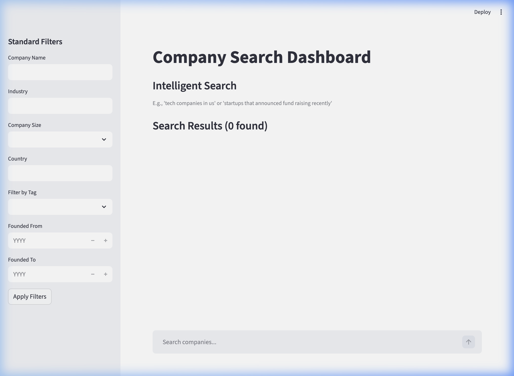
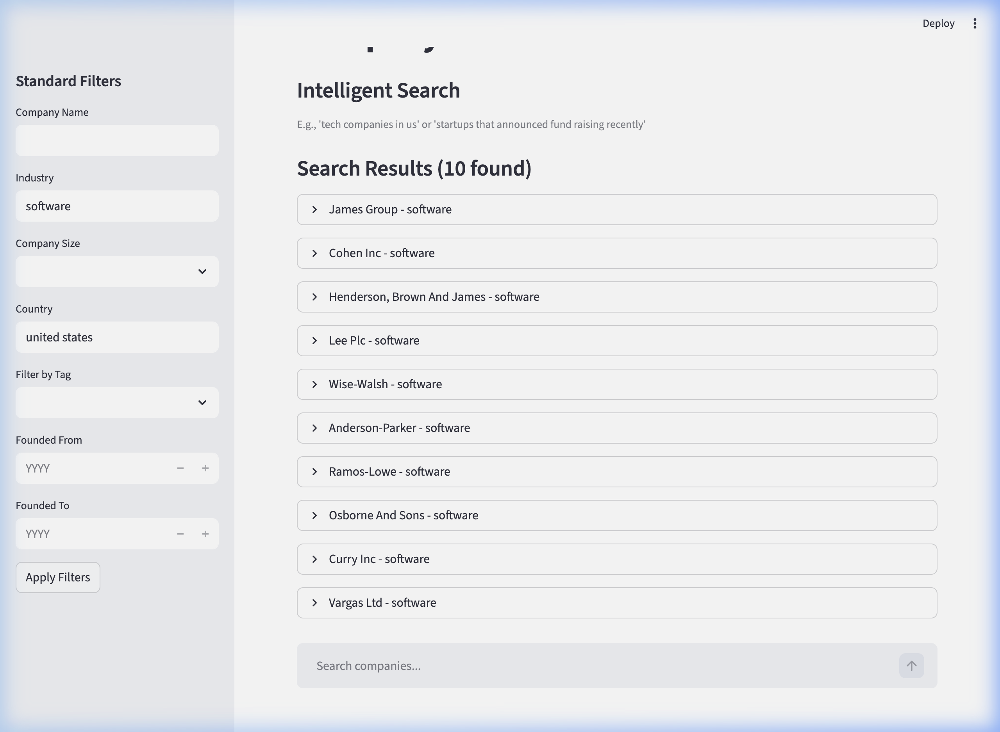
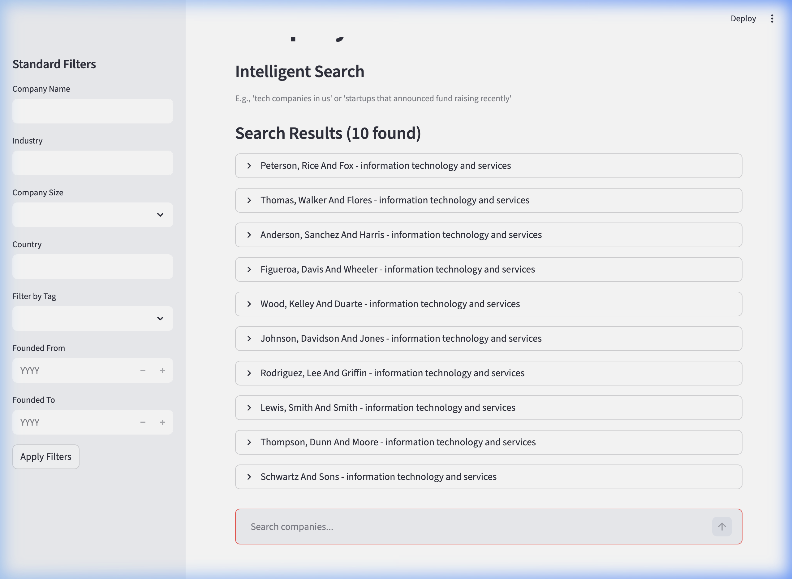

# Local Search Demo

This document demonstrates the successful integration between the Streamlit Frontend and the FastAPI Backend for both deterministic filtering and intelligent agentic search.

## Verified Workflows

The frontend integration tests verify that queries correctly pass through the backend Gateway API to OpenSearch and the Inference Service.

### 1. Initial Dashboard Load
The interface loads correctly, connecting to `http://localhost:8000` internally via Docker Compose bridging.

### 2. Deterministic Search (Filters)
Applying strict keyword bounds (e.g., `Country = "united states"` and `Industry = "software"`) successfully executes Term queries against the OpenSearch inverted index.

### 3. Intelligent Semantic Search
Submitting natural language (e.g., `"tech companies in California"`) successfully traverses the system: 
1. The intent is parsed by LiteLLM securely.
2. The query is embedded via the Inference Service (PyTorch).
3. OpenSearch retrieves and scores the nearest semantic k-NN bounds.

### End-to-End Test Recording
Watch the automated browser test session interacting with the live environment orchestrating flawlessly over native localhost port bindings:

