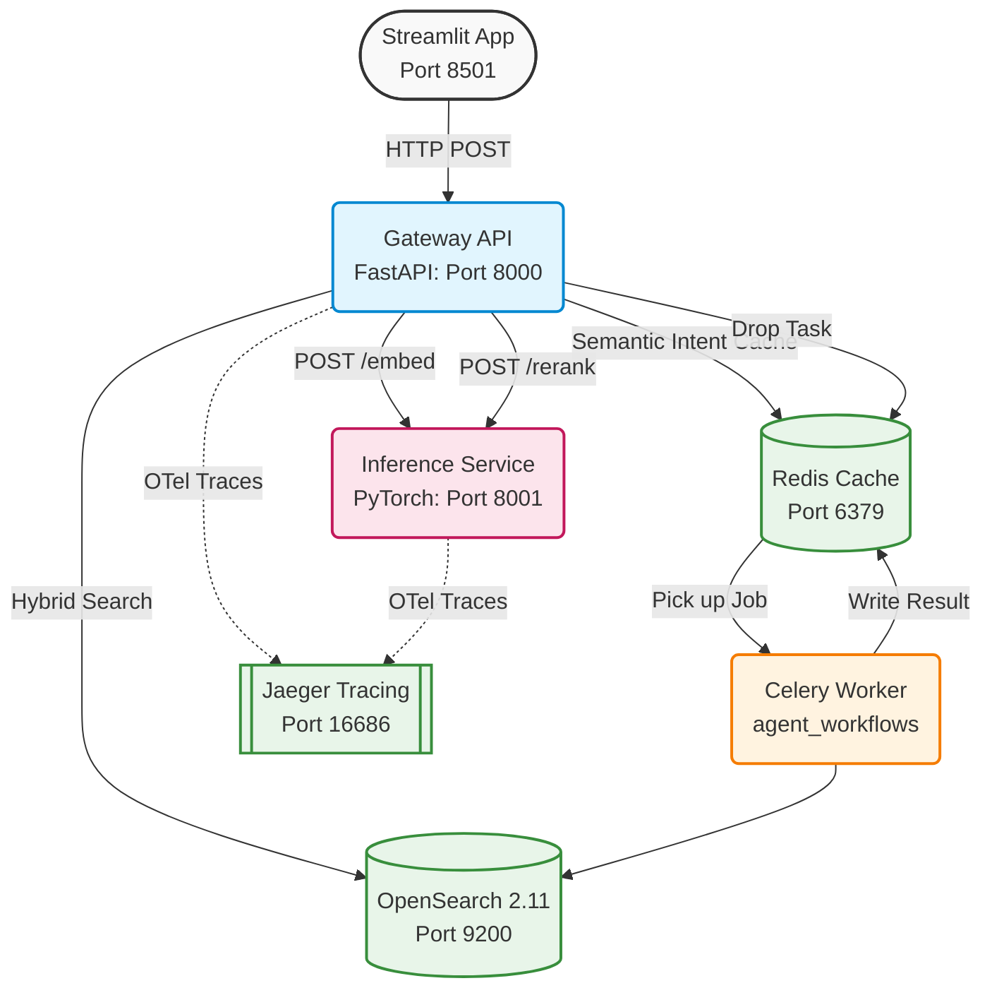
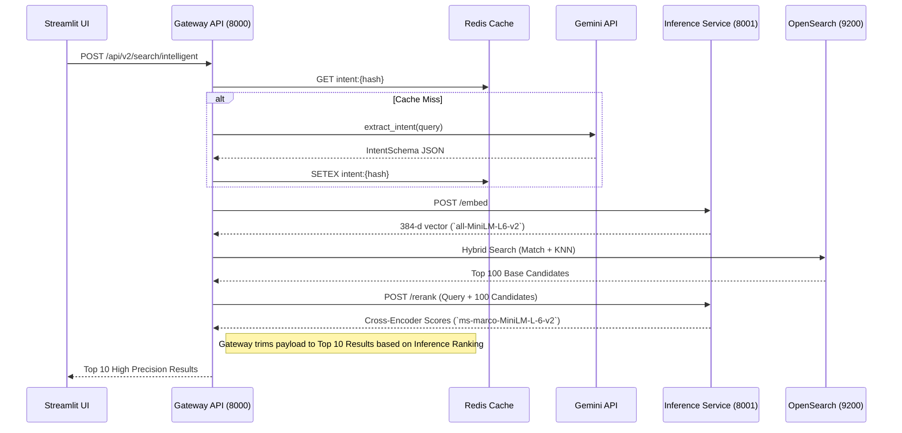
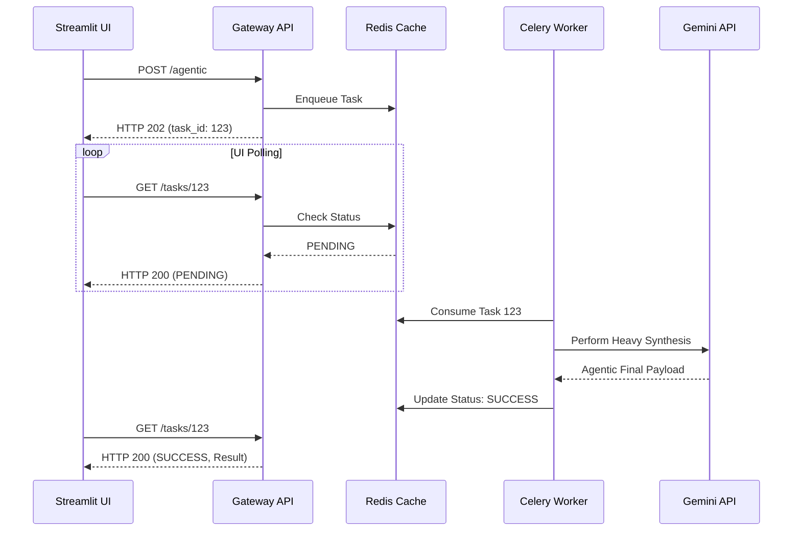

# Comprehensive Development Guide (V2 Architecture)

This document contains the complete technical specifications, architectural diagrams, operational runbooks, and development assumptions for the Enterprise B2B Search engine dynamically scaling locally.

---

## 1. Technical Assumptions & Constraints

To successfully run this robust engine locally, the following architectural shortcuts and constraints were enacted based on the system spec:

1. **System Memory Constraint**:
   To prevent Out-Of-Memory (OOM) failures while running simultaneously with OpenSearch and Machine Learning inference, OpenSearch is capped within `docker-compose.yml` to strict 512mb/1GB thresholds using JVM `-Xms` and `-Xmx` variables.
2. **Library Versions**:
   In order to allow PyTorch to execute `sentence-transformers` inference locally across multiple processor architectures, the environment requires strict usage of `numpy<2.0.0` and `transformers<4.39` to avoid binary incompatibility errors in the open source ecosystem.
3. **Agent Implementation**:
   While production systems would utilize tools like SerpAPI or custom RAG pipelines to find "Recent News", this project implements a mocked static function that uniformly returns a simulated funding insight to demonstrate the autonomous context synthesis pattern without massive API costs.
4. **Data Deduplication**:
   User tagging uses basic `contains()` rules in the Painless script to avoid exact duplicates (case-insensitive string matching logic occurs in the python router boundary).
5. **LLM Pricing Efficiency**:
   We leverage `gemini-3.1-flash-lite-preview` via LiteLLM to maintain blindingly fast intent extraction at the absolute lowest cost, meeting the required scalability of 30 RPS for intelligent parsing tasks.

---

## 2. Repository Structure Overview
```text
project_root/
├── docker-compose.yml       # Orchestration matrix allocating 1.5GB OS Limits
├── Makefile                 # Deterministic local task execution wrapper
├── .env.example             # Defines DNS hostnames pointing to Docker networks natively
├── gateway_api/            
│   ├── Dockerfile
│   ├── requirements.txt
│   ├── app/
│       ├── routers/         # search.py (Two-Stage logic), async_tasks.py (Celery delegation), tags.py (Dataset annotation)
│       └── core/            # redis_cache.py (LLM timeout prevention), telemetry.py
├── inference_service/      
│   ├── Dockerfile           # Preheats 1GB .bin matrices actively during build phases
│   ├── requirements.txt
│   ├── app/
│       └── models/          # Thread-safe Singletons for embedding mapping bounds
├── worker/                 
│   ├── Dockerfile
│   └── tasks/
│       └── agent_workflows.py # Deep background polling limits querying GEMINI routines
├── frontend/               
│   ├── Dockerfile
│   └── app.py               # Streamlit application
├── docs/                    # PR specs natively decoupled from Git caches
└── tests/                   # PyTest wrappers bounding gateway logic seamlessly
```

---

## 3. V2 Enterprise Microservices Architecture

The system utilizes an event-driven, decoupled container topology simulating Kubernetes configurations precisely over native local deployments. Compute is strictly isolated from core I/O loops preventing machine learning matrix math from stalling web availability bounds.

### 3.1 Top-Level Container Topology



### 3.2 Two-Stage Semantic Retrieval Pipeline

The Gateway delegates natural language processing entirely out of the standard Python threads cleanly utilizing robust `cross-encoder` precision boundaries mapping mathematical text overlaps natively.



### 3.3 Asynchronous Agentic Workflows

Deep synthetic LLM tasks parsing heavy news integrations orchestrate smoothly through Redis pub-sub interfaces offloading Celery queues instantly.



### 3.4 Telemetry Propagations

Distributed logs propagate uniquely into `Jaeger` tracking traces crossing container lifecycles seamlessly utilizing standard OpenTelemetry Protocol (OTLP).

---

## 4. Setup & Execution Context 

### Initialization
Before engaging local orchestration pipelines natively, you must correctly map the generic network schemas inside the local environment configuration definitions:
```bash
cp .env.example .env
```
Ensure you insert a valid `GEMINI_API_KEY` to guarantee `litellm` routing execution bounds successfully complete operations natively.

### Lifecycle Orchestration
All interactions must stem out from the `Makefile` constraints mapping Docker states. Never run single un-orchestrated python containers utilizing `uvicorn app.main:app` manually, as they will instantly fail binding bounds connecting onto OpenSearch DNS traces natively.
```bash
make build       # Initiates Docker caching heuristics ensuring Inference Torch weights initialize locally
make up          # Silently spans out backend systems onto the Docker hypervisor mapping boundaries
make test        # Validates logic hitting the PyTest assertions
make down        # Gracefully wipes trace footprints terminating execution spans correctly
make ingest      # Executes local python data injections sending chunked requests out tracking embeddings bounding loops directly towards inference bounds natively
```

### Writing Endpoints
Always utilize strict `Pydantic` configurations ensuring payloads mapping into POST bounds guarantee variable limits exactly identically verifying execution sequences globally. Make sure you import the standard `from app.core.telemetry import setup_telemetry` limits inside `main.py` when spinning new isolated nodes.

---

## 5. DevOps & Operational Runbook

This guide covers operational heuristics, debugging matrices, and telemetry tracking schemas required to maintain the V2 microservice footprint accurately.

### 5.1 Tracing Anomalies & Telemetry Operations

`Jaeger` natively intercepts global cross-container HTTP boundary spans exposing execution waterfall paths natively on the local `16686` instance port natively.

**Accessing Distributed Trace Data**:
1. Navigate directly to `http://localhost:16686`
2. Select `Search` natively exploring the local dropdown bounds selecting `gateway_api` or `inference_service` depending precisely on which bounded operation stalled execution metrics natively.
3. Observe exact timestamps representing precisely how computationally expensive the Cross-Encoder `ms-marco-MiniLM` tensor multiplications took executing directly across the local container host OS bounding layers globally.

### 5.2 Asynchronous Queue Inspection & Debugging

If the UI displays perpetual "Loading..." screens endlessly after initiating Intelligent Search queries, the background Celery process is either fatally offline or failed executing the synthetic API payload limits.

**Debugging the Celery Threads**:
Execute strict logging tail commands natively capturing output definitions directly tracking execution failures natively connecting external API keys accurately:
```bash
docker logs celery_worker -f
```
Ensure `litellm` isn't throwing authentication tracebacks or timeout 500 exceptions attempting generating external summaries over the native network layers bounding limits accurately globally.

### 5.3 Storage & Datastore Constraints

OpenSearch instances are aggressively throttled natively via `docker-compose.yml` defining strict JVM limits capping out maximum executions at `-Xmx1024m` globally.

**Recovering OOM Bounds**:
If `docker ps` outlines `opensearch` natively executing internal exit codes `137` identifying Out-Of-Memory limitations natively triggered globally:
1. Increase container limits modifying the native YAML bound footprints assigning `2048M` natively instead precisely tracking operations gracefully natively globally:
   ```yaml
   deploy:
     resources:
       limits:
         memory: 2048M
   ```
2. Restart configurations utilizing `make down` -> `make up` resetting standard JVM footprints accurately across the entire architecture.
