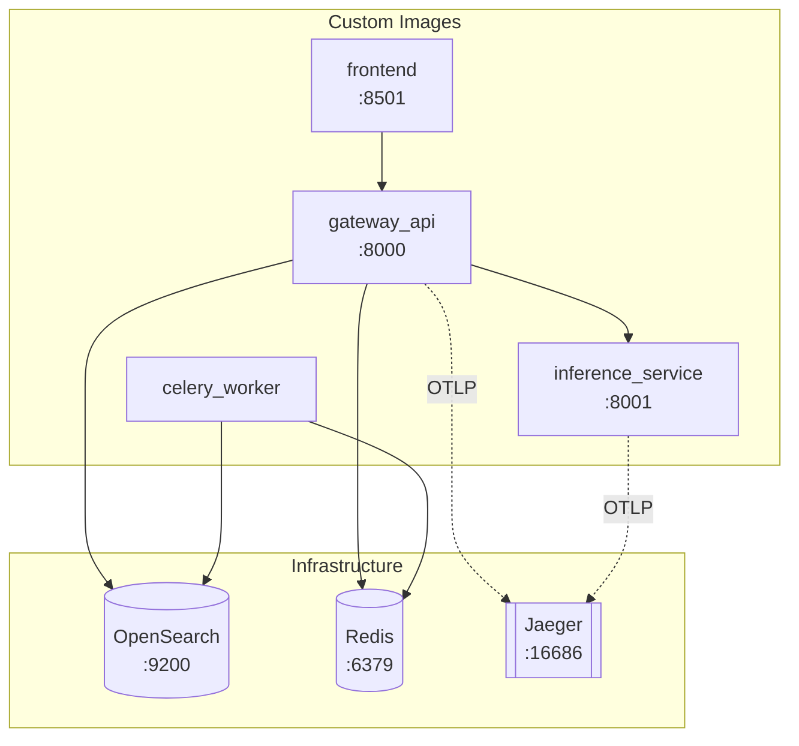

# Docker Architecture Guide

This document explains the containerization strategy, Dockerfile design, and `docker-compose.yml` orchestration for the Enterprise B2B Company Search platform.

---

## 1. Service Topology

The platform runs **8 containers** orchestrated via Docker Compose:

| Service | Image | Port | Role |
|---------|-------|------|------|
| `gateway_api` | Custom (`src/api/Dockerfile`) | 8000 | FastAPI REST gateway |
| `inference_service` | Custom (`src/inference/Dockerfile`) | 8001 | PyTorch ML inference (embed + rerank) |
| `celery_worker` | Custom (`src/worker/Dockerfile`) | — | Background agentic task processing |
| `frontend` | Custom (`src/frontend/Dockerfile`) | 8501 | Streamlit UI |
| `opensearch` | `opensearchproject/opensearch:2.11.0` | 9200 | Search datastore (BM25 + KNN) |
| `redis` | `redis:alpine` | 6379 | Cache, task broker |
| `jaeger` | `jaegertracing/all-in-one:latest` | 16686 | Distributed tracing |
| `opensearch-dashboards` | `opensearchproject/opensearch-dashboards:2.11.0` | 5601 | Search analytics UI |
| `data_ingester` | Reuses worker image | — | One-shot CSV ingestion (profile: `ingest`) |



---

## 2. Multi-Stage Dockerfile Architecture

All four custom services use a **two-stage** Dockerfile pattern: a `builder` stage for dependency installation and a `runtime` stage with minimal footprint.

### 2.1 Build Stage (Builder)

```dockerfile
# syntax=docker/dockerfile:1

FROM python:3.11-slim-bookworm AS builder

ENV UV_COMPILE_BYTECODE=1 \
    UV_LINK_MODE=copy

COPY --from=ghcr.io/astral-sh/uv:latest /uv /bin/uv

WORKDIR /app

# Dependencies cached separately from source code
COPY pyproject.toml uv.lock ./
RUN --mount=type=cache,target=/root/.cache/uv \
    uv sync --frozen --no-install-project --no-dev

# Source code layer
COPY src/ /app/src/
RUN --mount=type=cache,target=/root/.cache/uv \
    uv sync --frozen --no-dev
```

### 2.2 Runtime Stage

```dockerfile
FROM python:3.11-slim-bookworm AS runtime

# Signal handling for graceful shutdown
RUN apt-get update && \
    apt-get install -y --no-install-recommends dumb-init curl && \
    rm -rf /var/lib/apt/lists/*

# Non-root user
RUN groupadd --system appuser && \
    useradd --system --gid appuser --create-home appuser

WORKDIR /app

# Copy with ownership (avoids separate chown layer)
COPY --from=builder --chown=appuser:appuser /app/.venv /app/.venv
COPY --from=builder --chown=appuser:appuser /app/src /app/src

ENV PATH="/app/.venv/bin:$PATH"
USER appuser

ENTRYPOINT ["/usr/bin/dumb-init", "--"]
CMD ["uvicorn", "src.api.main:app", "--host", "0.0.0.0", "--port", "8000", "--workers", "4"]
```

### 2.3 Key Optimizations

| Technique | Purpose |
|-----------|---------|
| **Multi-stage build** | Builder has compilers/headers; runtime is minimal |
| `python:3.11-slim-bookworm` | Minimal Debian base (~150MB) |
| `--mount=type=cache,target=/root/.cache/uv` | BuildKit cache mount — persists `uv` downloads between builds |
| `UV_COMPILE_BYTECODE=1` | Pre-compiles `.pyc` files for faster startup |
| `UV_LINK_MODE=copy` | Copies packages instead of symlinking (safe for multi-stage) |
| `COPY --chown=appuser:appuser` | Sets ownership during copy (avoids doubling layer with `RUN chown`) |
| `dumb-init` | PID 1 signal forwarding — enables graceful `SIGTERM` shutdown |
| Non-root `appuser` | Security: containers don't run as root |
| Separate dep/source layers | Docker layer caching — deps rebuilt only when lockfile changes |

### 2.4 Per-Service Variations

#### Gateway API (`src/api/Dockerfile`)
Standard multi-stage pattern. 4 uvicorn workers. Includes `curl` for healthcheck.

#### Inference Service (`src/inference/Dockerfile`)
Adds `--extra ml` for PyTorch/sentence-transformers. Warms up HuggingFace models during build:

```dockerfile
# Builder stage: download models at build time
ENV HF_HOME=/app/.model_cache
RUN /app/.venv/bin/python -c "from src.inference.models.embedding_model import get_embedding_model; get_embedding_model()"
RUN /app/.venv/bin/python -c "from src.inference.models.reranker_model import get_reranker_model; get_reranker_model()"

# Runtime stage: copy model cache with ownership
COPY --from=builder --chown=appuser:appuser /app/.model_cache /app/.model_cache
ENV HF_HOME="/app/.model_cache"
```

#### Celery Worker (`src/worker/Dockerfile`)
Standard pattern. CMD: `celery -A src.worker.agent_workflows worker --loglevel=info`

#### Frontend (`src/frontend/Dockerfile`)
Standard pattern. CMD: `streamlit run src/frontend/app.py --server.port 8501`

---

## 3. `.dockerignore`

Comprehensive exclusions to minimize build context:

```
.git/                # VCS history
.github/             # CI workflows
.venv/ / venv/       # Virtual environments
__pycache__ / *.pyc  # Python caches
.mypy_cache / .pytest_cache / .ruff_cache
data/                # 7M row CSV — mounted at runtime, never baked in
tests/ / docs/ / spec/ / pr_description/
*.md / .env / .env.*
Makefile / .pre-commit-config.yaml
```

---

## 4. Docker Compose Orchestration

### 4.1 Healthchecks

Docker-native healthchecks ensure service readiness before dependents start:

```yaml
opensearch:
  healthcheck:
    test: ["CMD-SHELL", "curl -sf http://localhost:9200/_cluster/health || exit 1"]
    interval: 10s
    timeout: 5s
    retries: 30
    start_period: 30s

redis:
  healthcheck:
    test: ["CMD", "redis-cli", "ping"]
    interval: 5s
    retries: 10

gateway_api:
  healthcheck:
    test: ["CMD-SHELL", "curl -sf http://localhost:8000/health || exit 1"]
    interval: 10s
    retries: 10
    start_period: 15s

inference_service:
  healthcheck:
    test: ["CMD-SHELL", "curl -sf http://localhost:8001/health || exit 1"]
    interval: 10s
    retries: 20
    start_period: 60s    # ML model loading takes time
```

### 4.2 Service Dependencies with Health Conditions

Services wait for infrastructure to be **healthy**, not just started:

```yaml
gateway_api:
  depends_on:
    opensearch:
      condition: service_healthy
    redis:
      condition: service_healthy
    inference_service:
      condition: service_started

celery_worker:
  depends_on:
    redis:
      condition: service_healthy
    opensearch:
      condition: service_healthy

frontend:
  depends_on:
    gateway_api:
      condition: service_healthy
```

### 4.3 Resource Limits

Every service has CPU and memory limits:

| Service | Memory | CPU |
|---------|--------|-----|
| `opensearch` | 1.5GB | 2.0 |
| `inference_service` | 2GB | 2.0 |
| `gateway_api` | 1GB | 1.0 |
| `celery_worker` | 1GB | 1.0 |
| `frontend` | 512MB | 0.5 |
| `redis` | 256MB | 0.5 |
| `jaeger` | 512MB | 0.5 |
| `opensearch-dashboards` | 512MB | 0.5 |

### 4.4 Data Ingestion Profile

The `data_ingester` runs only on demand via Docker Compose profiles:

```bash
make ingest                  # Default: 7M rows
make ingest LIMIT=10000      # Quick test
```

Uses `/usr/bin/dumb-init` entrypoint with `/app/.venv/bin/python` to run the ingestion script.

---

## 5. CI/CD BuildKit Integration

The CI E2E job (when enabled) uses Docker BuildKit for advanced caching:

```yaml
- name: Set up Docker Buildx
  uses: docker/setup-buildx-action@v3

- name: Start services
  run: make wait
  env:
    DOCKER_BUILDKIT: "1"
    COMPOSE_DOCKER_CLI_BUILD: "1"
```

---

## 6. Common Operations

| Command | Description |
|---------|-------------|
| `make up` | `docker compose up --build -d` |
| `make wait` | Start + poll until healthy |
| `make down` | `docker compose down` |
| `make build` | Build images only |
| `make test-e2e` | Start services + run E2E tests |
| `make ingest` | Run data ingestion |
| `docker stats --no-stream` | Verify resource limits |
| `docker exec gateway_api whoami` | Verify non-root user |

---

## 7. Dependency Management

| Group | Used By | Install Flag |
|-------|---------|-------------|
| Core `dependencies` | All 4 services | `--no-dev` |
| `ml` optional extra | Inference only | `--extra ml` |
| `dev` group | Local dev only | Stripped by `--no-dev` |
