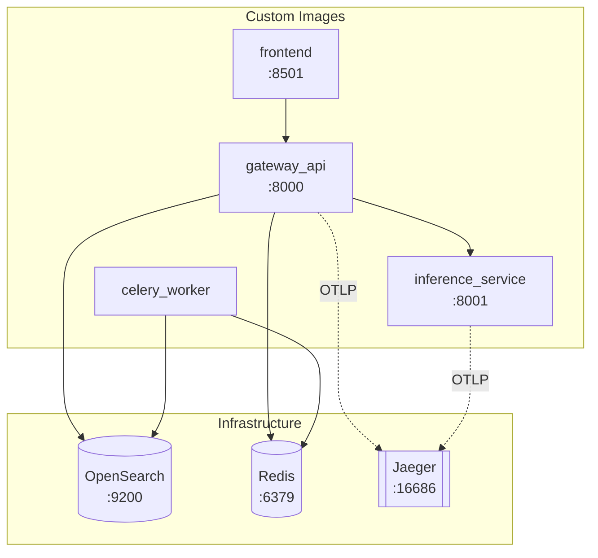

# Docker Architecture Guide

This document explains the containerization strategy, Dockerfile design, and `docker-compose.yml` orchestration for the Enterprise B2B Company Search platform.

---

## 1. Service Topology

The platform runs **8 containers** orchestrated via Docker Compose:

| Service | Image | Port | Role |
|---------|-------|------|------|
| `gateway_api` | Custom (`src/api/Dockerfile`) | 8000 | FastAPI REST gateway |
| `inference_service` | Custom (`src/inference/Dockerfile`) | 8001 | PyTorch ML inference (embed + rerank) |
| `celery_worker` | Custom (`src/worker/Dockerfile`) | — | Background agentic task processing |
| `frontend` | Custom (`src/frontend/Dockerfile`) | 8501 | Streamlit UI |
| `opensearch` | `opensearchproject/opensearch:2.11.0` | 9200 | Search datastore (BM25 + KNN) |
| `redis` | `redis:alpine` | 6379 | Cache, task broker |
| `jaeger` | `jaegertracing/all-in-one:latest` | 16686 | Distributed tracing |
| `opensearch-dashboards` | `opensearchproject/opensearch-dashboards:2.11.0` | 5601 | Search analytics UI |
| `data_ingester` | Reuses worker image | — | One-shot CSV ingestion (profile: `ingest`) |



---

## 2. Dockerfile Design

All four custom services follow the same Dockerfile pattern, optimized for fast builds and small images.

### 2.1 Common Pattern

Every Dockerfile uses a consistent three-step approach:

```dockerfile
# 1. Base: slim Python image
FROM python:3.11-slim

# 2. Install uv from official OCI image
COPY --from=ghcr.io/astral-sh/uv:latest /uv /uvx /bin/

WORKDIR /app

# 3. Dependency layer (cached separately from source)
COPY pyproject.toml uv.lock ./
RUN uv sync --frozen --no-install-project --no-dev

# 4. Source layer (invalidated on code changes only)
COPY src /app/src

CMD ["uv", "run", "uvicorn", "src.api.main:app", "--host", "0.0.0.0", "--port", "8000"]
```

**Key optimizations:**

| Technique | Purpose |
|-----------|---------|
| `python:3.11-slim` | Minimal base (~150MB vs ~900MB for full) |
| `COPY --from=ghcr.io/astral-sh/uv:latest` | Zero-install package manager via multi-stage copy |
| `uv sync --frozen` | Deterministic installs from lockfile |
| `--no-install-project` | Deps cached separately from source code |
| `--no-dev` | Strips test/lint tools from prod images |
| Separate `COPY pyproject.toml` → `COPY src` | Docker layer caching: deps only rebuilt when `pyproject.toml` or `uv.lock` change |

### 2.2 Gateway API (`src/api/Dockerfile`)

Standard pattern. Runs `uvicorn` with the FastAPI app on port 8000.

```dockerfile
FROM python:3.11-slim
COPY --from=ghcr.io/astral-sh/uv:latest /uv /uvx /bin/
WORKDIR /app
COPY pyproject.toml uv.lock ./
RUN uv sync --frozen --no-install-project --no-dev
COPY src /app/src
CMD ["uv", "run", "uvicorn", "src.api.main:app", "--host", "0.0.0.0", "--port", "8000"]
```

### 2.3 Inference Service (`src/inference/Dockerfile`)

Extends the base pattern with **ML extras** and **model warm-up**:

```dockerfile
# ML dependencies via optional extra
RUN uv sync --frozen --no-install-project --no-dev --extra ml

COPY src /app/src

# Pre-download models during build (not at startup)
RUN uv run python -c "from src.inference.models.embedding_model import get_embedding_model; get_embedding_model()"
RUN uv run python -c "from src.inference.models.reranker_model import get_reranker_model; get_reranker_model()"
```

**Why `--extra ml`?** Heavy ML dependencies (`torch`, `sentence-transformers`, `numpy`) are isolated into an optional `[ml]` extra in `pyproject.toml`. Only the inference service installs them — keeping gateway, worker, and frontend images ~1GB smaller.

**Why warm up during build?** HuggingFace models (`all-MiniLM-L6-v2`, `ms-marco-MiniLM-L-6-v2`) are downloaded into the image layer during `docker build`, not during container startup. This ensures instant readiness at runtime.

### 2.4 Celery Worker (`src/worker/Dockerfile`)

Standard pattern. Runs the Celery worker process:

```dockerfile
CMD ["uv", "run", "celery", "-A", "src.worker.agent_workflows", "worker", "--loglevel=info"]
```

### 2.5 Frontend (`src/frontend/Dockerfile`)

Standard pattern. Runs Streamlit:

```dockerfile
CMD ["uv", "run", "streamlit", "run", "src/frontend/app.py", "--server.port", "8501", "--server.address", "0.0.0.0"]
```

---

## 3. `.dockerignore`

A comprehensive `.dockerignore` prevents sending unnecessary files to the Docker daemon:

```
.venv                # Local virtual environment
venv
__pycache__          # Python bytecode
*.pyc
.git                 # Version control history
.github              # CI workflows
.pytest_cache        # Test caches
.mypy_cache
.ruff_cache
archive              # Repo markdown archives
data                 # 7M row CSV — mounted at runtime, never baked in
docs                 # Documentation
tests                # Test suite
```

> **Important**: The `data/` directory is explicitly excluded. The 7M row company dataset must be volume-mounted at runtime (via `data_ingester` service), never copied into the image.

---

## 4. Docker Compose Orchestration

### 4.1 Build Context

All custom services share the **project root** as build context with per-service Dockerfiles:

```yaml
gateway_api:
  build:
    context: .                         # Project root
    dockerfile: ./src/api/Dockerfile   # Service-specific Dockerfile
```

This allows all Dockerfiles to `COPY pyproject.toml uv.lock ./` and `COPY src /app/src` from the project root — sharing the same dependency lockfile and source tree.

### 4.2 Environment Variable Injection

Runtime configuration is injected via environment variables, consumed by `pydantic-settings` `Settings` class:

```yaml
gateway_api:
  environment:
    - GEMINI_API_KEY=${GEMINI_API_KEY}     # Host → container passthrough
    - OPENSEARCH_URL=http://opensearch:9200 # Docker DNS resolution
    - REDIS_URL=redis://redis:6379/0
    - INFERENCE_URL=http://inference_service:8001
    - OTEL_EXPORTER_OTLP_ENDPOINT=http://jaeger:4317
```

Services reference each other by **container name** via Docker's internal DNS — e.g., `http://opensearch:9200` resolves to the OpenSearch container.

### 4.3 Volume Mounts

Development volume mounts enable hot-reload without rebuilding:

```yaml
gateway_api:
  volumes:
    - ./src/:/app/src    # Live source code mount
```

This shadows the `COPY src /app/src` layer in the Dockerfile, so local edits are reflected immediately inside the container.

### 4.4 Resource Limits

Critical services have memory limits to prevent OOM on development machines:

```yaml
opensearch:
  deploy:
    resources:
      limits:
        memory: 1536M    # Matches OPENSEARCH_JAVA_OPTS=-Xmx1024m

inference_service:
  deploy:
    resources:
      limits:
        cpus: "2"
        memory: 2048M    # PyTorch models require significant RAM
```

### 4.5 Data Ingestion Profile

The `data_ingester` service uses Docker Compose **profiles** to run only on demand:

```yaml
data_ingester:
  profiles: ["ingest"]                              # Not started by default
  entrypoint: ["uv", "run", "python", "scripts/ingest_data.py"]
  command: >
    --file data/${DATA_FILE:-companies.csv}
    --limit ${LIMIT:-7000000}
  volumes:
    - ./data:/app/data        # CSV mount
    - ./scripts:/app/scripts  # Ingestion script mount
```

Triggered via:
```bash
make ingest                  # Runs with default 7M row limit
make ingest LIMIT=10000      # Quick test with 10K rows
```

### 4.6 Service Dependencies

```yaml
gateway_api:
  depends_on:
    - opensearch
    - redis
    - inference_service

celery_worker:
  depends_on:
    - redis
    - opensearch
```

---

## 5. Common Operations

### Starting the Stack
```bash
make up          # docker compose up --build -d
make wait        # Polls gateway:8000/health + opensearch:9200 until ready
```

### Stopping
```bash
make down        # docker compose down
```

### Building Without Starting
```bash
make build       # docker compose build
```

### Viewing Logs
```bash
docker logs gateway_api -f          # Follow gateway logs
docker logs celery_worker -f        # Debug agentic workflows
docker logs inference_service -f    # ML model loading issues
```

### Inspecting Running Containers
```bash
docker ps                           # Status of all containers
docker stats --no-stream            # Memory/CPU usage snapshot
```

### Running E2E Tests
```bash
make test-e2e    # Starts services via make wait, then runs pytest -m e2e
```

---

## 6. Dependency Management Strategy

Dependencies are split across `pyproject.toml`:

```toml
[project]
dependencies = [
    "fastapi", "uvicorn", "opensearch-py",
    "pydantic", "pydantic-settings",
    "celery", "redis", "litellm",
    "streamlit", "httpx", ...
]

[project.optional-dependencies]
ml = [
    "sentence-transformers>=2.2.2",
    "torch<=2.2.2",
    "numpy<2.0.0",
    "transformers<4.39",
]

[dependency-groups]
dev = ["pytest", "ruff", "mypy", ...]
```

| Group | Used By | Flag |
|-------|---------|------|
| Core `dependencies` | All 4 services | `--no-dev` |
| `ml` extra | Inference service only | `--extra ml` |
| `dev` group | Local development only | (default, stripped by `--no-dev`) |
