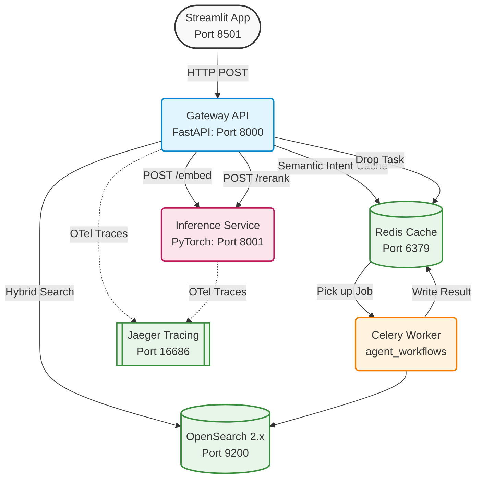
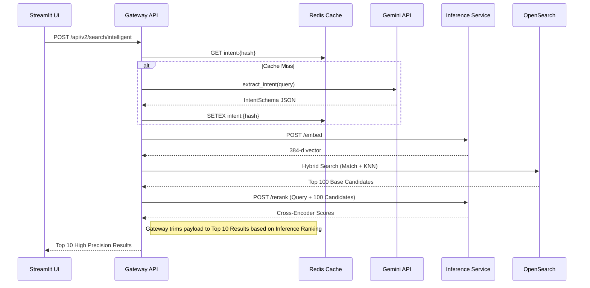
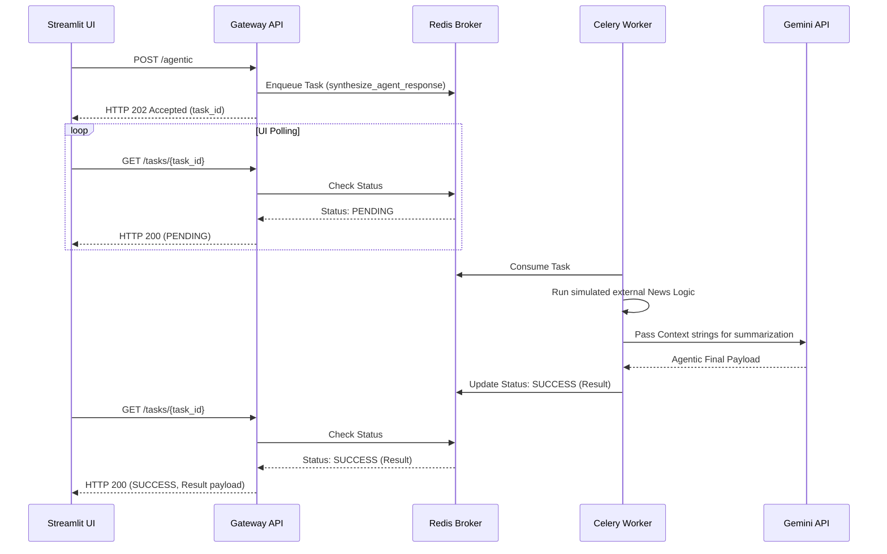

# V2 Microservices Architecture Details

## 1. High-Level Distributed Architecture

The system decouples the Streamlit frontend from the FastAPI routing logic, which delegates to specialized service modules depending on whether the query is deterministic or natural language. ML execution is strictly isolated into an unblockable inference thread.

## 2. Two-Stage Retrieval Flow (`/api/v2/search/intelligent`)

## 3. Asynchronous Agentic Flow (`POST /api/v2/search/agentic`)

