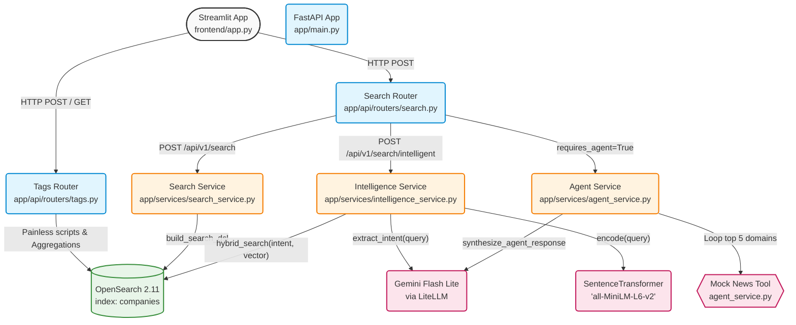
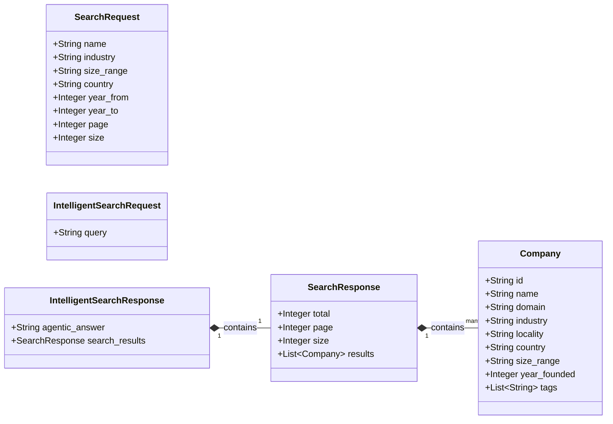
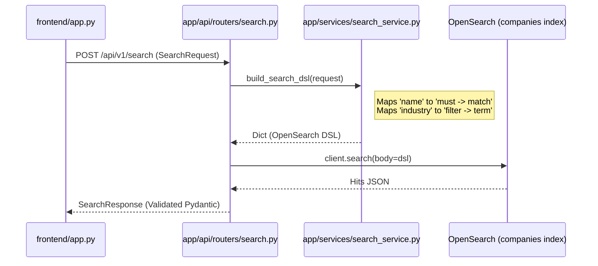
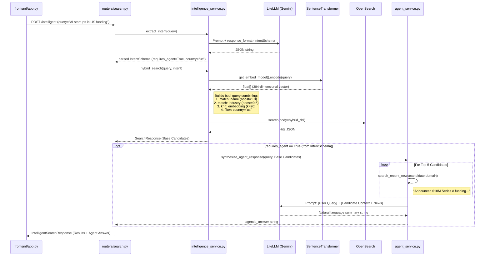

# Architecture Details

This document outlines the detailed system architecture, codebase breakdown, retrieval pipelines, and sequence flows of the Enterprise Company Search API system. The architecture is deeply coupled to the exact Python codebase implementations throughout the `app/` directory.

## 1. High-Level System Architecture

The system decouples the Streamlit frontend from the FastAPI routing logic, which delegates to specialized service modules depending on whether the query is deterministic or natural language.



---

## 2. Pydantic Domain Entities

The API strictly governs request/response boundaries via `app/models/schemas.py`:



---

## 3. Core Operational Sequences

### 3.1 Deterministic Search Sequence (`POST /api/v1/search`)
Fast, exact-match searches relying entirely on `build_search_dsl` mapped to OpenSearch boolean logic (`must` matches and `term`/`range` filters).



### 3.2 Intelligent Search & Agentic Fallback Sequence (`POST /api/v1/search/intelligent`)
The intelligent API orchestrates structured response parsing from Gemini, falls back to a custom local-vector hybrid query, and injects context into a secondary generative synthesis loop.



---

## 4. Tagging Architecture Sequence (`POST /api/v1/companies/{id}/tags`)
The tagging system is strictly implemented on the backend datastore avoiding inefficient read-modify-write Python blocks.

```mermaid
sequenceDiagram
    participant UI as frontend/app.py
    participant API as tags.py
    participant OS as OpenSearch
    
    UI->>API: POST /api/v1/companies/123/tags {"tag": "competitor"}
    API->>API: Validate tag string
    API->>OS: client.update(id="123", body={script: Painless})
    note right of API: Painless Script logic:<br/>if (tags == null) init List;<br/>if (!tags.contains) add tag;
    OS-->>API: 200 OK (Updated Document)
    API-->>UI: 200 OK
```

---

## 5. Streaming Ingestion Pipeline

To solve the 7 million row out-of-memory bottleneck defined in the specs, ingestion leverages Polars lazy chunking alongside pipelined vectorizations.

```mermaid
flowchart LR
    CSV[(data/companies.csv)] -->|pl.read_csv_batched<br/>batch_size=5000| Loop[While chunk in batches]
    
    subgraph Python Chunking Loop [ingest_data.py]
    Loop --> Clean[Lowercasing & Cast Ints]
    Clean --> StringMerge[concat: name+industry+locality]
    StringMerge -->|Encode| STrans[SentenceTransformers<br/>encode(batch)]
    STrans --> BuildDoc[Build OpenSearch JSON Doc]
    Clean --> BuildDoc
    end
    
    BuildDoc -->|Bulk API actions| OS[(OpenSearch <br/>index: companies)]
    
    OS --> Loop
```
