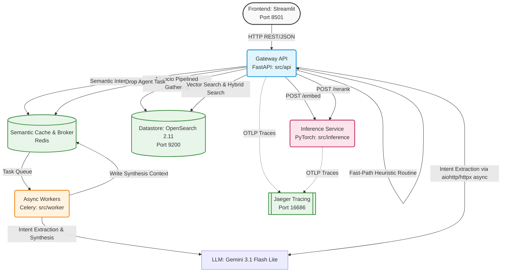
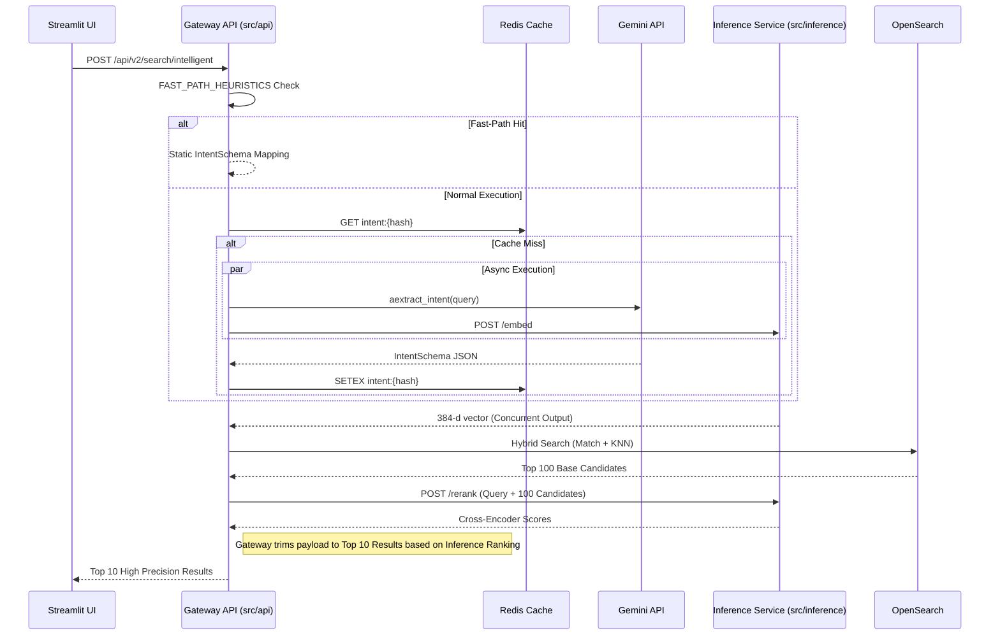
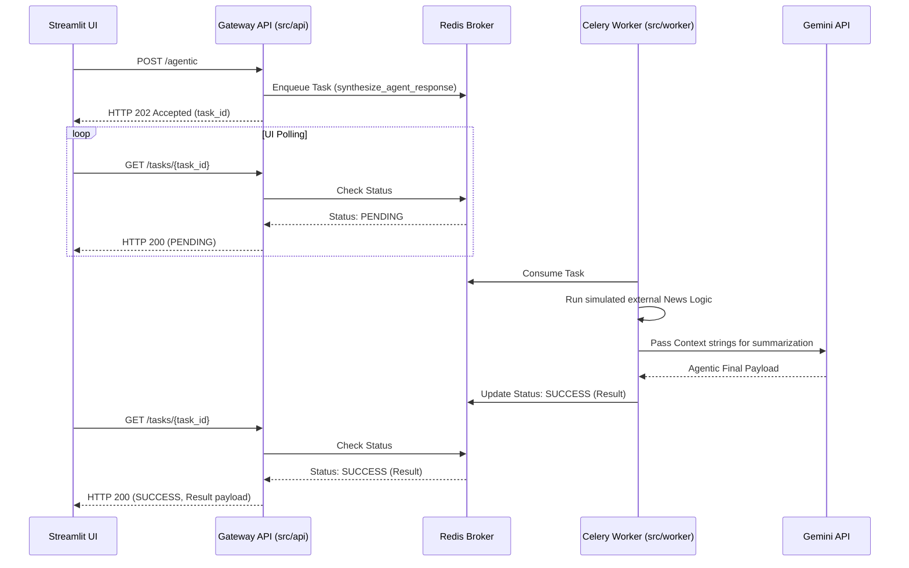

# Enterprise B2B Company Search (V5 Architecture)

## 1. High-Level Distributed Architecture

The system utilizes a production-grade, distributed microservices architecture (V5) designed for extreme concurrency, strict compute isolation, and low-latency I/O scaling. It decouples the Streamlit frontend from the FastAPI routing logic, delegating query execution dynamically via **Dependency Injection** and **Strategy Patterns**. The asynchronous core leverages `asyncio.gather()` bounding concurrent OpenSearch and LiteLLM interactions.

**Architecture Components & Data Flow (Mapped to `src/` Layout):**

*   **Frontend UI (`src/frontend/`)**: Built with Streamlit, providing deterministic input fields alongside a conversational chat box for natural language queries. It interacts dynamically with the Gateway via REST API calls.
*   **Gateway API (`src/api/`)**: The highly concurrent FastAPI entry point that routes requests using Dependency Injection. It handles deterministic queries and intelligent hybrid search, fully decoupling blocking I/O calls through native Python `asyncio.gather()` functions dynamically scaling concurrency.
*   **Datastore (OpenSearch 2.11)**: Acts as both an inverted index for keyword matching (BM25) and a vector database utilizing HNSW graphs for semantic cosine similarity. It natively ingests data utilizing bounded `opensearch.helpers.async_bulk` mappings maximizing index performance via `-1` refresh intervals.
*   **Inference Service (`src/inference/`)**: A dedicated PyTorch+FastAPI container isolating CPU-bound ML matrix math. It generates 384-dimensional dense vectors via `all-MiniLM-L6-v2` natively at the edge, and executes a massive cross-encoder (`ms-marco-MiniLM-L-6-v2`) for pairwise re-ranking.
*   **Asynchronous Workers (`src/worker/`)**: Deep synthetic LLM tasks parsing heavy news integrations orchestrate smoothly through Redis pub-sub interfaces offloading Celery queues instantly.
*   **Intelligence Layer**: Powered by LiteLLM bound strictly to `gemini-3.1-flash-lite-preview`. It leverages strict Pydantic JSON enforcement. Bypassed entirely when incoming strings natively match predefined `FAST_PATH_HEURISTICS` entities (yielding ~0ms network extraction bounds)!
*   **Observability**: Standard OpenTelemetry (OTLP) headers are securely injected across the HTTP boundary natively into a Jaeger instance. Developers can visually dissect precise execution lengths traversing from the FastAPI Gateway directly into the Inference service on localhost:16686.

## 2. Fast-Path + Two-Stage Retrieval Flow (`/api/v2/search/intelligent`)

*   **Fast-Path Recognition**: The Gateway rapidly regexes/matches the lowercased input text against an exact dictionary. If matched, it returns a mapped static JSON Schema instantly effectively bypassing external HTTP calls.
*   **Intent Extraction & Caching**: The gateway concurrently hashes the user query checking a 24-hour `redis.asyncio` semantic cache while pinging the LLM. 
*   **Stage 1 (Async High Recall)**: Through internal `asyncio.gather()`, the Gateway calls the Inference Service to embed the query natively parallel matching the explicit intent boundaries! It executes a broad k-NN hybrid bounds search inside OpenSearch retrieving the Top 100 loose candidate companies.
*   **Stage 2 (High Precision)**: Exactly these 100 text overlaps are sent to the Remote NLP Re-Ranker endpoint (Cross-Encoder) explicitly scoring pairs. This whittles the candidates down to the Top 10, returning incredibly precise mappings globally.

## 3. Asynchronous Agentic Flow (`POST /api/v2/search/agentic`)

Deep agentic tasks (like contextual competitive synthesis or fetching recent funding news) natively bypass standard thread execution to prevent an immediate HTTP stall:
1.  **Queue Deferral**: The Gateway intercepts an agentic requirement and drops the context into a Redis semantic task queue, immediately returning an HTTP 202 `task_id`.
2.  **Background Processing**: The background Celery worker autonomously evaluates the task, calls the simulated Mock API (`search_recent_news`), and triggers the LLM to write a summarized agentic response decoupling totally from Gateway constraints.
3.  **UI Polling**: The Streamlit frontend utilizes an async polling API checking the Celery status execution flags seamlessly without stalling interfaces using HTTP 202 Accepted.

