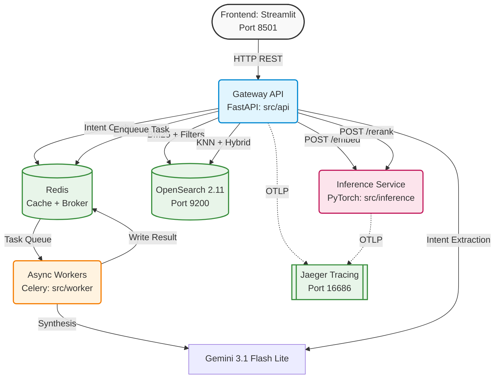
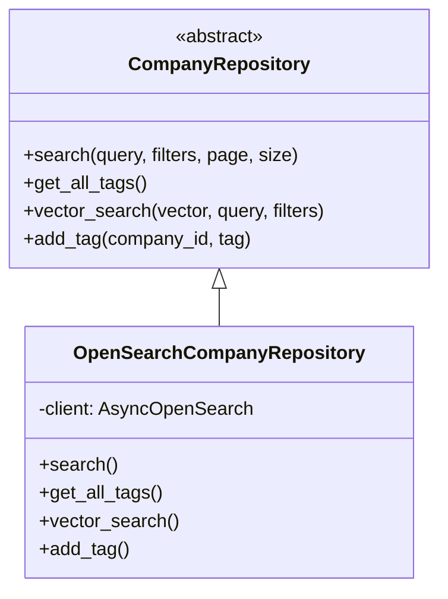
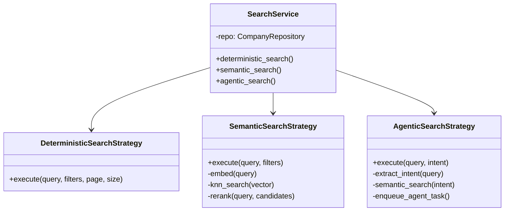
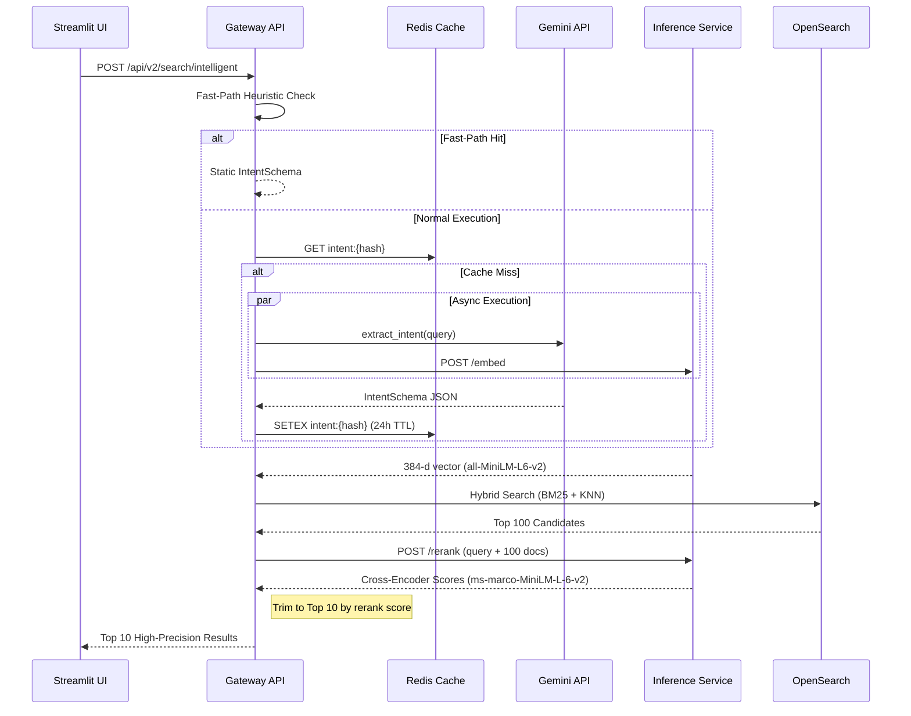
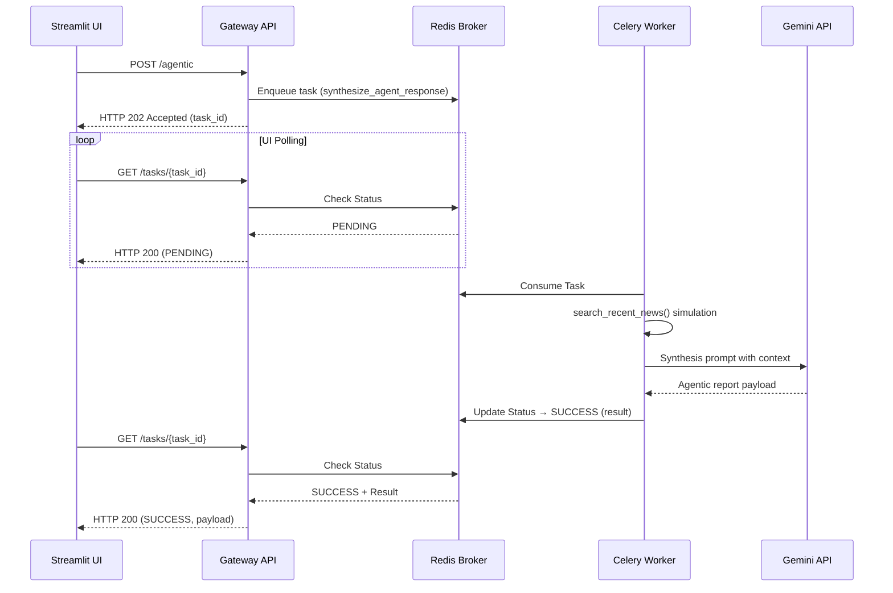

# Enterprise B2B Company Search Architecture (V8)

## 1. System Architecture

The system uses a distributed microservices architecture with strict compute isolation: ML inference is separated from API routing, and long-running LLM tasks are offloaded to background workers via Celery.



---

## 2. Design Patterns

### 2.1 Repository Pattern (Data Access)

All data access is abstracted behind the `CompanyRepository` ABC in `src/api/domain/interfaces.py`:



**Benefits:**
- Business logic in strategies/services is decoupled from OpenSearch query DSL
- Unit tests use mock repositories — no Docker needed
- Future migration (e.g., to Elasticsearch or PostgreSQL) only requires a new implementation

### 2.2 Strategy Pattern (Search Routing)

Three search strategies implement different retrieval approaches:



| Strategy | Endpoint | Pipeline |
|----------|----------|----------|
| Deterministic | `/api/v2/search/deterministic` | Direct BM25 + filters → OpenSearch |
| Semantic | `/api/v2/search/intelligent` | Embed → KNN → Rerank |
| Agentic | `/api/v2/search/agentic` | Intent → Semantic + Background Agent |

### 2.3 Centralized Configuration

`pydantic-settings` validates all environment variables at startup:

```python
class Settings(BaseSettings):
    OPENSEARCH_URL: str = "http://localhost:9200"
    REDIS_URL: str = "redis://localhost:6379/0"
    INFERENCE_URL: str = "http://localhost:8001"
    GEMINI_API_KEY: str = ""
    PROFILING_ENABLED: bool = False
```

Injected via `get_settings()` (cached singleton) — replaces scattered `os.getenv()`.

---

## 3. Two-Stage Semantic Retrieval (`/api/v2/search/intelligent`)



**Pipeline Steps:**
1. **Fast-Path**: Regex/dictionary match bypasses LLM entirely (~0ms)
2. **Intent + Embed** (parallel): LLM extracts structured intent while inference computes query vector
3. **Stage 1 (High Recall)**: KNN + BM25 hybrid search retrieves 100 loose candidates
4. **Stage 2 (High Precision)**: Cross-encoder rescores all 100 candidates pairwise, returns top 10

---

## 4. Asynchronous Agentic Flow (`POST /api/v2/search/agentic`)

Heavy LLM synthesis is offloaded to Celery workers to prevent HTTP timeouts:



---

## 5. Observability

OpenTelemetry spans propagate across service boundaries via OTLP:

| Service | Instrumented |
|---------|-------------|
| Gateway API | FastAPI auto-instrumentation |
| Inference Service | FastAPI auto-instrumentation |
| Jaeger UI | `http://localhost:16686` |

Trace spans show exact latencies for: intent extraction, embedding, KNN search, reranking, and agent synthesis.

---

## 6. Testing Architecture

| Layer | Count | Coverage | Docker Required |
|-------|-------|----------|----------------|
| Unit tests | 75 | 94% | No |
| E2E tests | 15 | — | Yes |
| Coverage floor | — | 85% | Enforced in CI |

Unit tests use mock repositories and strategies — no OpenSearch/Redis needed. E2E tests hit live containers via `make test-e2e`.
