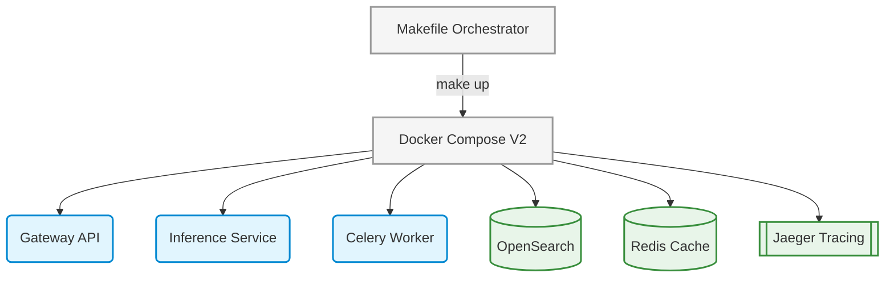

# PR: V2 Phase 1 - Distributed Infrastructure & DevEx

## Description
This PR bridges the gap between local monolithic execution and a true distributed microservice topology. It isolates environments mirroring production Kubernetes clusters but executed seamlessly locally via Compose.

### Changes Made

1. **V2 Container Orchestration (`docker-compose.yml`)**:
   - Defined 7 explicit containers: `gateway_api`, `inference_service`, `celery_worker`, `opensearch`, `redis`, `jaeger`, and `frontend`. 
   - Applied strict memory boundaries (`1.5GB` limit) for the OS JVM layer.
2. **Deterministic DevEx (`Makefile`)**:
   - Bootstrapped standardized deterministic scripts (`make up`, `make down`, `make test`, `make ingest`) to accelerate local orchestration.
3. **Environment Map (`.env.example`)**:
   - Outlines internal networking URLs mapped to native Docker DNS routing schemas instead of localhost loops.

### Architecture Overview

## Testing Instructions
1. Run `make up`. Observe all 7 containers boot successfully without immediate exit codes.
2. Run `docker stats` ensuring memory caps are strictly enforced on `opensearch`.
