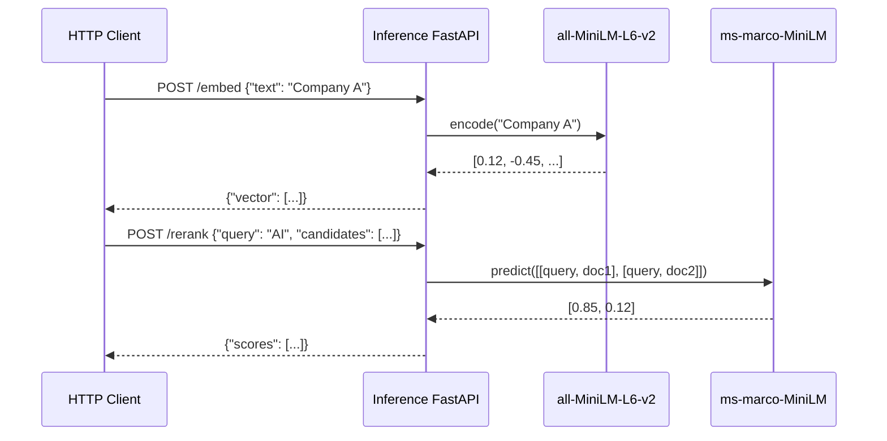

# PR: V2 Phase 2 - Inference Service (Compute Isolation)

## Description
This PR moves all heavy PyTorch operations (Sentence Transformers & Cross-Encoders) out of the web threads. This guarantees main asynchronous I/O Gateway thread pools are never stalled by Matrix multiplications.

### Changes Made

1. **Machine Learning API (`inference_service/app/main.py`)**:
   - Initialized a micro-FastAPI container strictly containing mathematical ML pipelines.
   - Exposed `POST /embed` generating `all-MiniLM-L6-v2` dense vectors.
   - Exposed `POST /rerank` utilizing `ms-marco-MiniLM-L-6-v2` calculating explicit pairwise ranking confidence metrics.
2. **Memory Singletons (`inference_service/app/models/`)**:
   - Extracted model initialization into thread-safe singleton patterns.
3. **Build-Time Preheat (`inference_service/Dockerfile`)**:
   - Included logic ensuring 1GB tensor models are downloaded dynamically at build-time preventing severe API timeouts during horizontal scale-up pods.

### Sequence Diagram

## Testing Instructions
1. Invoke the inference service using `PYTHONPATH=. pytest tests/test_inference.py`.
2. Inspect `docker logs inference_service` to confirm Fastapi initialized securely on `port 8001` and loaded `.bin` tensor weights during boot sequence.
