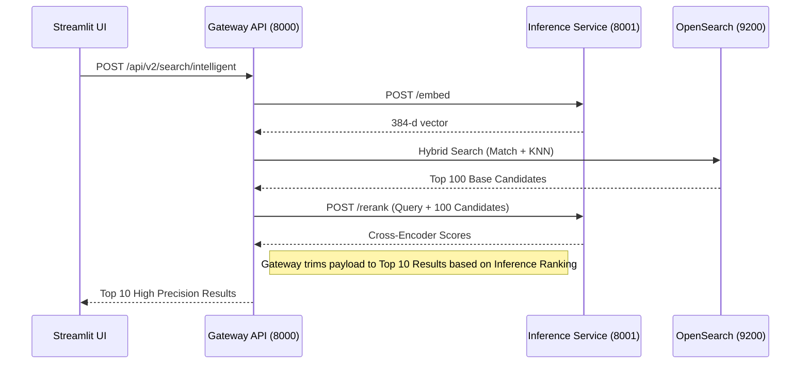

# PR: V2 Phase 3 - Gateway Core & Distributed Tracing

## Description
This PR maps exactly over to our primary entrypoint `gateway_api` exposing deterministic endpoints utilizing inter-service communication over TCP to interact heavily with OpenSearch and Inference concurrently.

### Changes Made

1. **Two-Stage Hybrid Retrieval (`gateway_api/app/services/opensearch_client.py`)**:
   - Migrated queries from monolith CPU threads into Remote HTTP embedding retrievals spanning the network boundary.
   - OpenSearch now hits Top 100 loose bounds mathematically refined exactly by Remote NLP Re-Ranker endpoints down to Top 10 High-Precision guarantees.
2. **Distributed Telemetry (`gateway_api/app/core/telemetry.py`)**:
   - Bootstrapped `opentelemetry` instrumenting spans targeting the local `jaeger` deployment mapped to HTTP boundaries.
   - Injected `FastAPIInstrumentor` across both Web and Inference containers.
3. **Frontend V2 Integration (`frontend/app.py`)**:
   - Swapped Streamlit API pointers dynamically pulling environment variables targeting the internal `gateway_api` Docker DNS.

### Architecture Overview

## Testing Instructions
1. Call tests via `pytest tests/test_gateway.py`. Validate the OpenSearch payload mock assertions hit inference networks natively.
2. Hit the telemetry dashboard at `http://localhost:16686` and observe trace spans bridging from `gateway_api` immediately into `inference_service` bounds.
