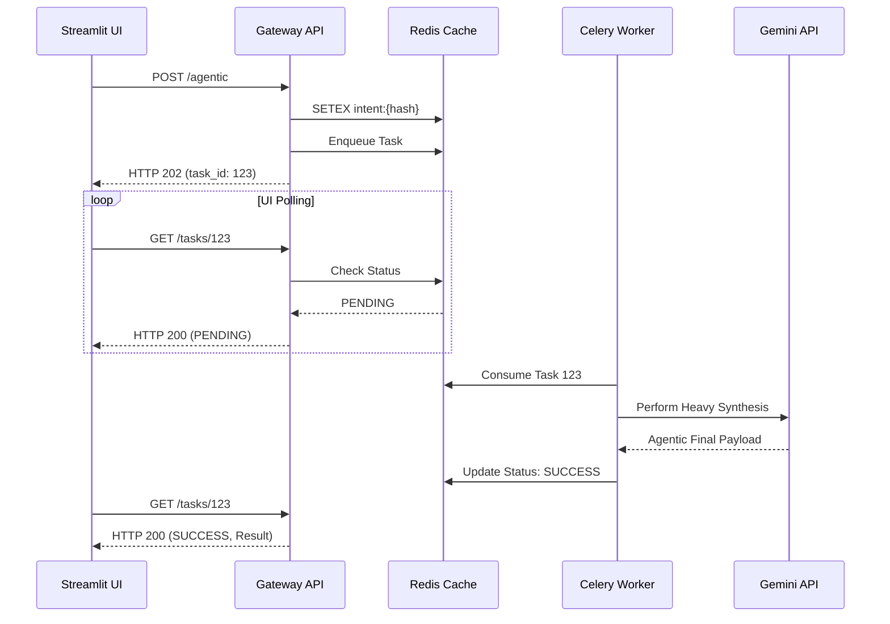

# PR: V2 Phase 4 - Agentic Asynchronous Task Queues

## Description
This PR stabilizes edge-case extreme latencies originating strictly from autonomous multi-stage LLM generation flows. It bridges FastAPI gateways returning deterministic 202 IDs mapped against Celery background queue processing pipelines.

### Changes Made

1. **Redis Semantic Caching (`gateway_api/app/core/redis_cache.py`)**:
   - Intercepts intelligent LLM intent classification hashing input raw-strings, completely blocking heavy HTTP LiteLLM traffic for previously asked questions over 24-hr expiry windows.
2. **Celery Deep Workers (`worker/tasks/agent_workflows.py`)**:
   - Offloads autonomous LLM document context integrations silently parsing mock news pipelines decoupled totally from Gateway constraints.
3. **Asynchronous Polling APIs (`gateway_api/app/routers/async_tasks.py`)**:
   - Handles Streamlit frontend requests checking Celery status execution flags seamlessly without stalling interfaces using `HTTP 202 Accepted`.

### Sequence Diagram

## Testing Instructions
1. Run application UI natively via Streamlit.
2. Issue an agentic specific natural language query. Watch the UI immediately spin in polling mode while `docker logs celery_worker` outputs synthesis completion queues. 
